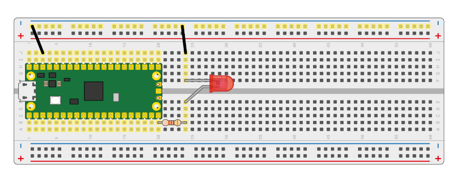
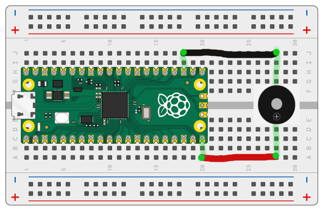
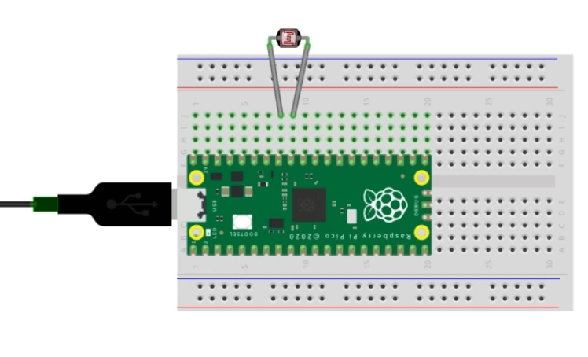

# l10_edge

* [X] 0. Prerequisites
* [X] 1. Examples

## 0. Prerequisites

[https://github.com/DarianHarrison/l10_edge/docs/prerequisites.md](https://github.com/DarianHarrison/l10_edge/blob/main/docs/prerequisites.md)


## 1. Examples


### A) Output

#### A.0) Wiring



#### A.1) GPIO output LED Blinky

* a) Plug the Pi Pico device to USB ```while holding boostel```
* b) compile & run program
```sh
cargo run --release --example gpio_out_blinky
```

#### A.2) GPIO output - LED PWM

* a) Plug the Pi Pico device to USB ```while holding boostel```
* b) compile & run program
```sh
cargo run --release --example gpio_out_pwm
```

#### A.3) PIO output - LED PWM

* a) Plug the Pi Pico device to USB ```while holding boostel```
* b) compile & run program
```sh
cargo run --release --example pio_out_pwm
```

#### A.4) GPIO output - Buzzer PWM

* a) Connect Buzzer Circuit



* b) Plug the Pi Pico device to USB ```while holding boostel```
* c) compile & run program
```sh
cargo run --release --example gpio_out_buzzer
```


### B) Input

#### B.0) Wiring



#### B.1) GPIO input - Photoresistor ADC to USB

* a) Plug the Pi Pico device to USB ```while holding boostel```
* b) compile & run program
```sh
cargo run --release --example gpio_in_adc_to_usb
```
* c) on another terminal - read data over usb
```sh
git clone https://github.com/DarianHarrison/l10_core
cd l10_core
cargo run 0x16c0 0x27dd
```


## TODOS
* [ ] configure different clocks and frequencies (3 to 5 examples)
* [ ] try to split rx receive and tx transmit on USB (USB PHY)
* [ ] set up an external clock with PIO
* [ ] clock dividers and baud rates with PIO
* [ ] PWM Period examples
* [ ] autopush with PIO
* [ ] sample external gpio pins with PIO
* [ ] access default usb counter instead of timer for the wrapping CDC 
* [ ] access default usb counter instead of timer
* [ ] interpolator test
