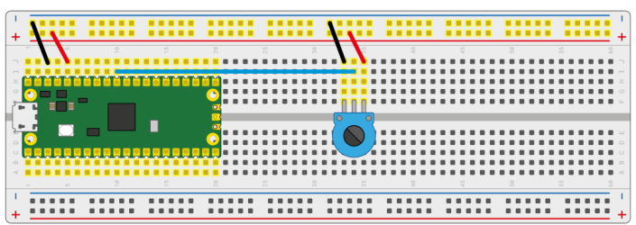
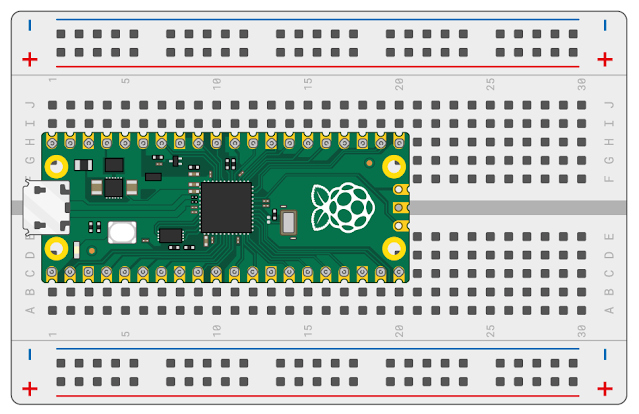
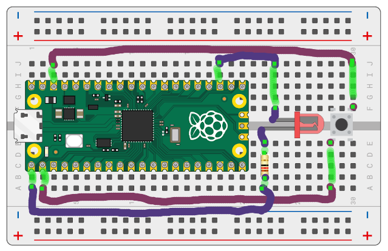
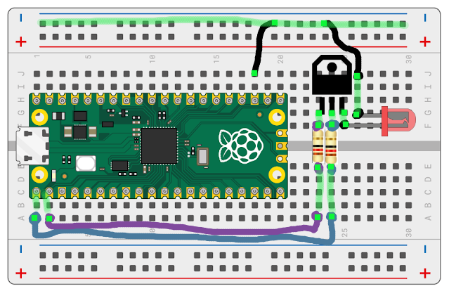
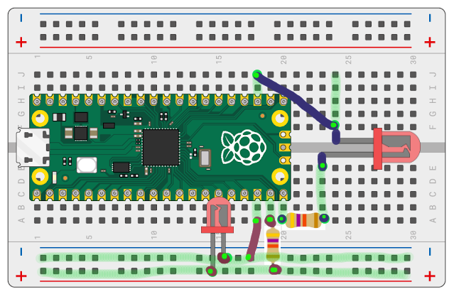

# pico_examples

This repository contains a variety of examples for the RP2040 microcontroller and Pi Pico board that we used while learning the Pico board.

* [X] 0. Prerequisites
* [X] 1. Examples

## 0. Prerequisites

[https://github.com/DarianHarrison/l10_edge_examples/docs/prerequisites.md](https://github.com/DarianHarrison/l10_edge_examples/blob/main/docs/prerequisites.md)


## 1. Examples

### Common

#### gpio_out_blinky

* This is a minor tweak from the original Blinky example from the rp_pico crate, except we are outputting to a GPIO Pin


```sh
cargo run --release --example gpio_out_blinky
```

#### pio_out_pwm

* This is a minor tweak from the original PWM example from the rp_pico crate, except we are outputting to a GPIO Pin


```sh
cargo run --release --example gpio_out_pwm
```

#### gpio_out_buzzer

* This example shows how to play some music by leveraging the Buzzer as an Output Pin


```sh
cargo run --release --example gpio_out_buzzer
```

#### tctr500_line

* This example leverages a tctr500 sensor that will activate whenever it comes into close contact with an object, i.e your finger.
* The sensor can be used, for isntance to prevent a collision of a tiny remote controlled car
* In this example we send the signal over to a hosted system via USB, however a LED can also be connected for some visual confirmation.




```sh
cargo run --release --example tctr500_line
```


#### adc_tempsense_oneshot_to_usb

* This eaxmple is based on the ADC Temperature Sensor example from the rp_pico crate
* A few modifications have been made to report the temperature with the formula from rp2040 documentation
* Data is then sent to USB.
* Note that no input pins are needed as the temprature sensor is embedded in the board



on l10_edge
```sh
cargo run --release --example adc_temperature_sensor
```

on l10_core
```sh
cargo run 0x16c0 0x27dd
```

#### adc_gpio_oneshot_to_usb

* This example shows how to read a pull up resistor input with OneShot (configure once) configuration.
* Data is then sent to USB.


on l10_edge
```sh
cargo run --release --example adc_gpio_oneshot
```

on l10_core
```sh
cargo run 0x16c0 0x27dd
```


#### button_input

* This example is based on the pico_gpio_in_out.rs from the rp_pico crate examples.
* The example uses a pullup input to conditionally turn on/off LED



```sh
cargo run --release --example button_input
```


#### transistor_switch

* This example uses one of the most beautiful components ever invented: **"The Transistor"** 
* This configuration leverages a pullup Input connected to the collector terminal 
* We then run a slow PWM on the Base Pin which acts an electronic button
* The LED connected to the Emitter Pin is meant to provide visual confirmation of how the Base gate is modulating the Input.




```sh
cargo run --release --example transistor
```


### PIO

* It is recommended to read Chapter 3 of the RP2040 Datasheet
* The following are a variety of examples that we leveraged while learning PIO programs.
* Note that the code is not meant to be super elegant. Once a concept was more or less proved, we skipped to the next example without going into much optimization depth.

#### pio_blinky

* This is an alternative of a way to blink the embedded LED


on l10_edge
```sh
cargo run --release --example pio_blinky
```

#### pio_sideset

* This is similar to the previous example ```pio_blinky```, except here we are using sideset pins
* In this example we leverage 2 LEDs. We alternate between turning one led ON, while the other is OFF, and viceversa



```sh
cargo run --release --example pio_sideset
```

#### pio_sm0_sm1

* This is similar to the previous example ```pio_sideset``` except here we are using two different StateMachines, each with their own PIO program
* Note that both PIO programs live in the same ```pio_sm0_sm1.pio``` file. 
* State machines can optionally be synchronized or grouped (note that this code is currently commented out in the code.) 


```sh
cargo run --release --example pio_sm0_sm1
```


#### pio_button_input

* This is an example to blink gpio output LED with based on a button input. 


```sh
cargo run --release --example pio_button_input
```

#### pio_dma_pwm

* This is a minor tweak of the original pwm.pio example in rp_pico crate examples.
* The program showcases how to dynamically "inject" variables into a PIO program (in this case the Period and Duty Cycle).
* The intensity output modulates the embedded LED; no wiring required.


```sh
cargo run --release --example pio_dma_pwm
```

#### pio_pwm_self_contained

* This example is similar to the previous example ```pio_dma_pwm```, except that Period and Duty Cycle variables are fixed within the PIO program.
* This example was used to test the clock divisor behavior of StateMachine objects.


```sh
cargo run --release --example pio_pwm_self_contained
```


#### pio_pwm_transistor

* This example uses one of the most beautiful components ever invented: **"The Transistor"**
* This configuration leverages a pullup Input connected to the collector terminal 
* We then run a PWM on the Base Pin which acts an electronic button. This PWM component is a minor tweak of the original pwm.pio example in rp_pico crate examples.
* The LED connected to the Emitter Pin is meant to provide visual confirmation of how the Base gate is modulating the Input.


```sh
cargo run --release --example pio_pwm_transistor
```


#### pio_frequency_counts

* This example uses one of the most beautiful components ever invented: **"The Transistor"**
* This example extends the previous example ```pio_pwm_transistor``` 
* In this example we count how many Pulses were captured in a time window
* We then showcase how to send this data over to a host system via USB.


on l10_edge
```sh
cargo run --release --example pio_frequency_counts
```

on l10_core
```sh
cargo run 0x16c0 0x27dd
```


#### Additional PIO programs

other intersting PIO programs can be found here: https://github.com/GitJer/Some_RPI-Pico_stuff/tree/main


## References

### board-crates
* https://crates.io/crates/embedded-hal
* https://crates.io/crates/rp2040-hal
* https://crates.io/crates/rp-pico

### arm-crates
* https://crates.io/crates/cortex-m

### USB
* https://github.com/rust-embedded-community/usbd-serial
* https://github.com/a1ien/rusb
* https://github.com/rust-embedded-community/usb-device

### Pico
Raspberry Pi Pico DataSheet
https://datasheets.raspberrypi.com/pico/pico-datasheet.pdf

rp2040 microcontroller DataSheet
https://datasheets.raspberrypi.com/rp2040/rp2040-datasheet.pdf

