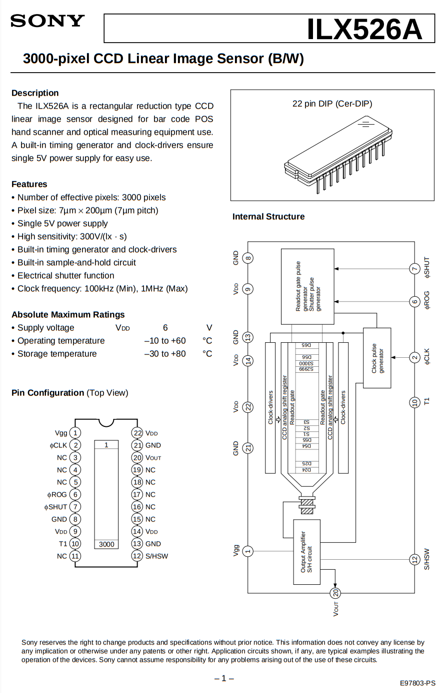

## l10_edge

// TODO: try to split rx receive and tx transmit on USB 
// TODO: verify how to configure pio (programmable input output)
// TODO: also need to export the clock for external devices, such as CCD
// TODO: also need to learn how to set up an external clock
// TODO: clock dividers and baud rates


Raspberry Pi Pico DataSheet
https://datasheets.raspberrypi.com/pico/pico-datasheet.pdf

rp2040 microcontroller DataSheet
https://datasheets.raspberrypi.com/rp2040/rp2040-datasheet.pdf


rp2040 microcontroller datasheet
https://datasheets.raspberrypi.com/pico/pico-datasheet.pdf




3000-pixel CCD Linear Image Sensor (B/W) - ILX526A Datasheet (PDF) - Sony Corporation
https://pdf1.alldatasheet.com/datasheet-pdf/view/47503/SONY/ILX526A.html


### GPIO ADC to USB HOST

1.) Wires


2.) Run photoresistor example
```sh
cargo run --release --example gpio_in_adc
```

3.) run core to read data over usb
https://github.com/DarianHarrison/l10_core
```sh
cargo run 0x16c0 0x27dd
```


## sources

// board-crates
```
https://crates.io/crates/embedded-hal
https://crates.io/crates/rp2040-hal
https://crates.io/crates/rp-pico
```

// arm-crates
```
https://crates.io/crates/cortex-m
```

// core
usb host system
```
https://github.com/rust-embedded-community/usbd-serial
https://github.com/a1ien/rusb
https://github.com/rust-embedded-community/usb-device
```