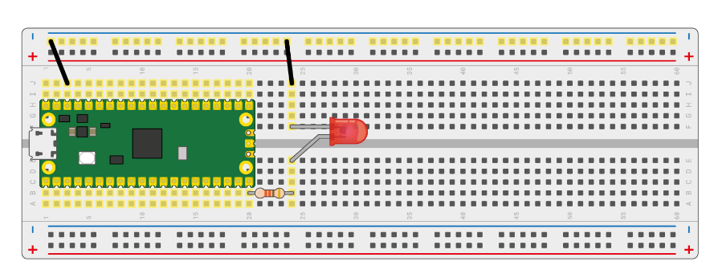
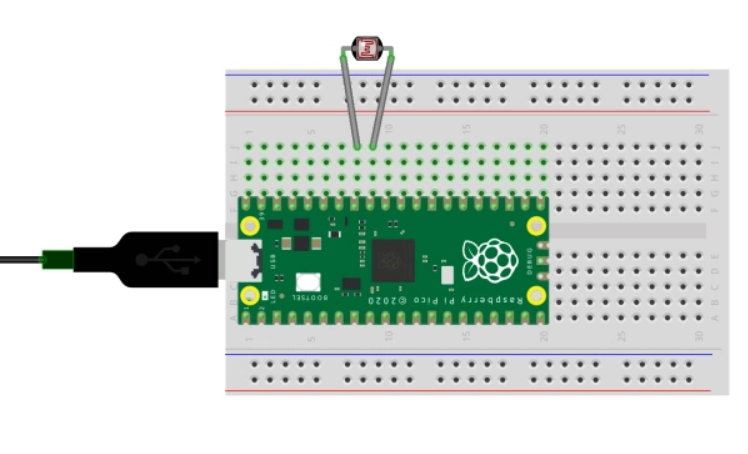
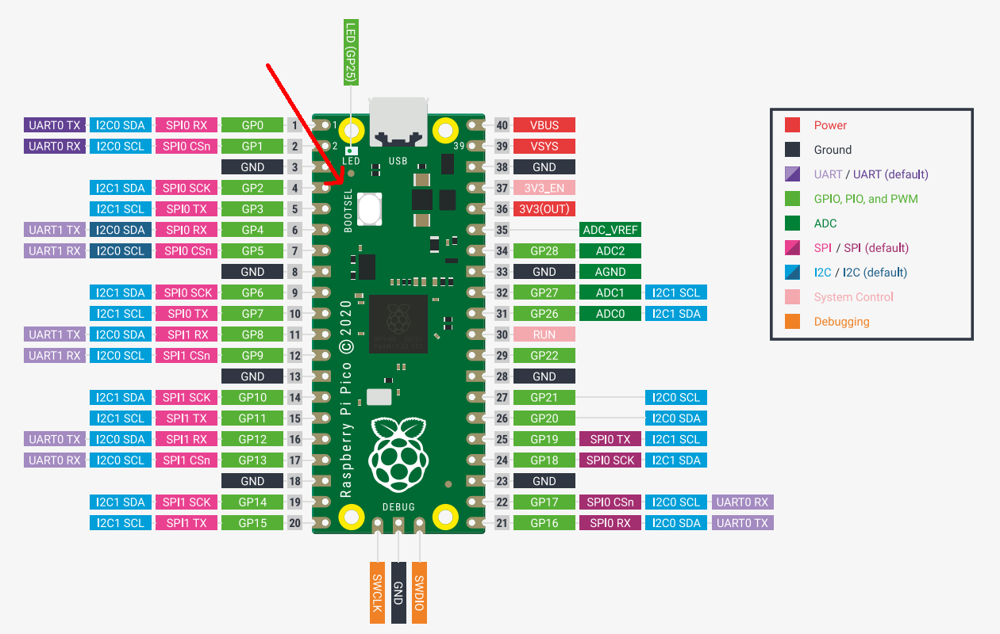

# l10_edge

## TODOS
* [ ] configure different clocks and frequencies (3 to 5 examples)
* [ ] try to split rx receive and tx transmit on USB (USB PHY)
* [ ] set up an external clock with PIO
* [ ] clock dividers and baud rates with PIO
* [ ] PWM Period examples
* [ ] autopush with PIO
* [ ] sample external gpio pins with PIO
* [ ] access default usb counter instead of timer for the wrapping CDC 
* [ ] access default usb counter instead of timer
* [ ] interpolator test

## 0. Prerequisites

```sh
git clone https://github.com/DarianHarrison/l10_edge
cd l10_edge
```

## 1. Examples

### A) Output



#### A.1) GPIO output LED Blinky

a) Plug the Pi Pico device to USB **while holding boostel**

b) compile & run program
```sh
cargo run --release --example gpio_out_blinky
```

#### A.2) GPIO output - LED PWM
a) Plug the Pi Pico device to USB **while holding boostel**

b) compile & run program
```sh
cargo run --release --example gpio_out_pwd
```

#### A.3) PIO output - LED PWM
a) Plug the Pi Pico device to USB **while holding boostel**

b) compile & run program
```sh
cargo run --release --example pio_out_pwm
```

### B) Input



#### B.1) GPIO input - Photoresistor ADC to USB

a) Plug the Pi Pico device to USB **while holding boostel**

b) compile & run program
```sh
cargo run --release --example gpio_in_adc_to_usb
```

c) on another terminal - read data over usb
```sh
git clone https://github.com/DarianHarrison/l10_core
cd l10_core
cargo run 0x16c0 0x27dd
```

## References

// board-crates
https://crates.io/crates/embedded-hal
https://crates.io/crates/rp2040-hal
https://crates.io/crates/rp-pico

// arm-crates
https://crates.io/crates/cortex-m

// core
usb host system
https://github.com/rust-embedded-community/usbd-serial
https://github.com/a1ien/rusb
https://github.com/rust-embedded-community/usb-device

3000-pixel CCD Linear Image Sensor (B/W) - ILX526A Datasheet (PDF) - Sony Corporation
https://pdf1.alldatasheet.com/datasheet-pdf/view/47503/SONY/ILX526A.html

Raspberry Pi Pico DataSheet
https://datasheets.raspberrypi.com/pico/pico-datasheet.pdf

rp2040 microcontroller DataSheet
https://datasheets.raspberrypi.com/rp2040/rp2040-datasheet.pdf





