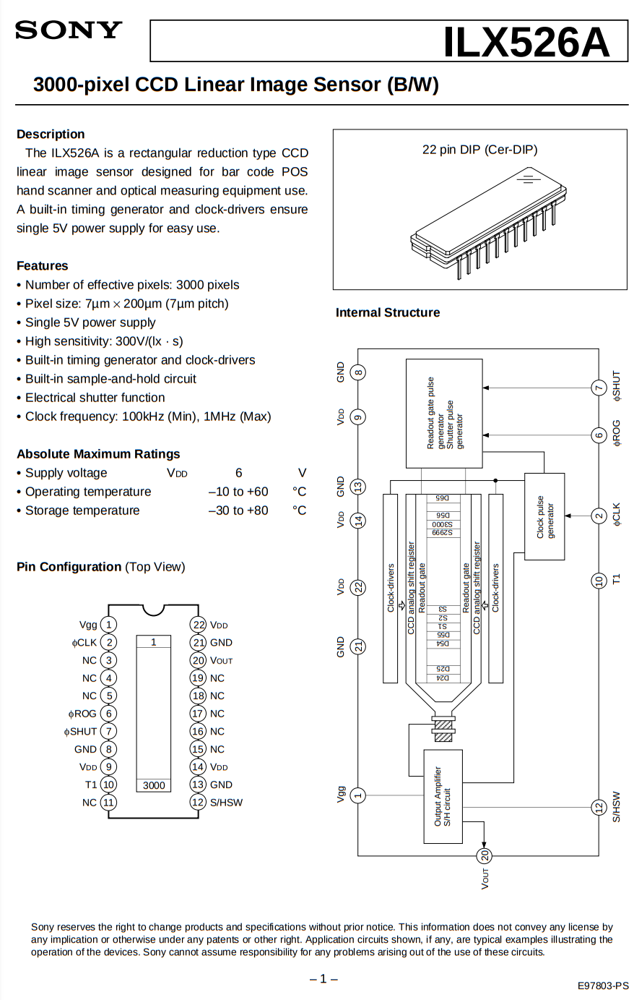
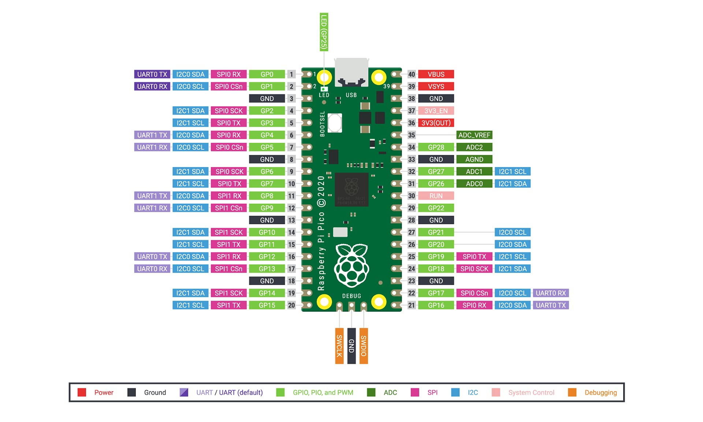
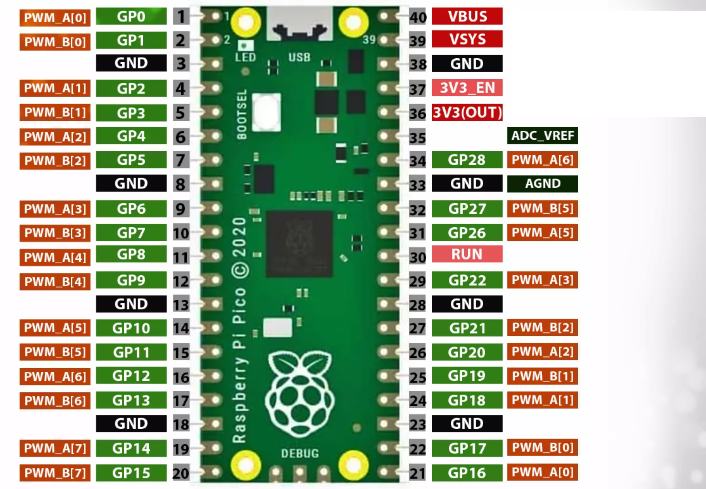

# Lion10 Edge References

## board-crates
* https://crates.io/crates/embedded-hal
* https://crates.io/crates/rp2040-hal
* https://crates.io/crates/rp-pico

## arm-crates
* https://crates.io/crates/cortex-m

## USB
* https://github.com/rust-embedded-community/usbd-serial
* https://github.com/a1ien/rusb
* https://github.com/rust-embedded-community/usb-device

## CCD
* 3000-pixel CCD Linear Image Sensor (B/W) - ILX526A Datasheet (PDF) - Sony Corporation
https://pdf1.alldatasheet.com/datasheet-pdf/view/47503/SONY/ILX526A.html

## Pico
Raspberry Pi Pico DataSheet
https://datasheets.raspberrypi.com/pico/pico-datasheet.pdf

rp2040 microcontroller DataSheet
https://datasheets.raspberrypi.com/rp2040/rp2040-datasheet.pdf

